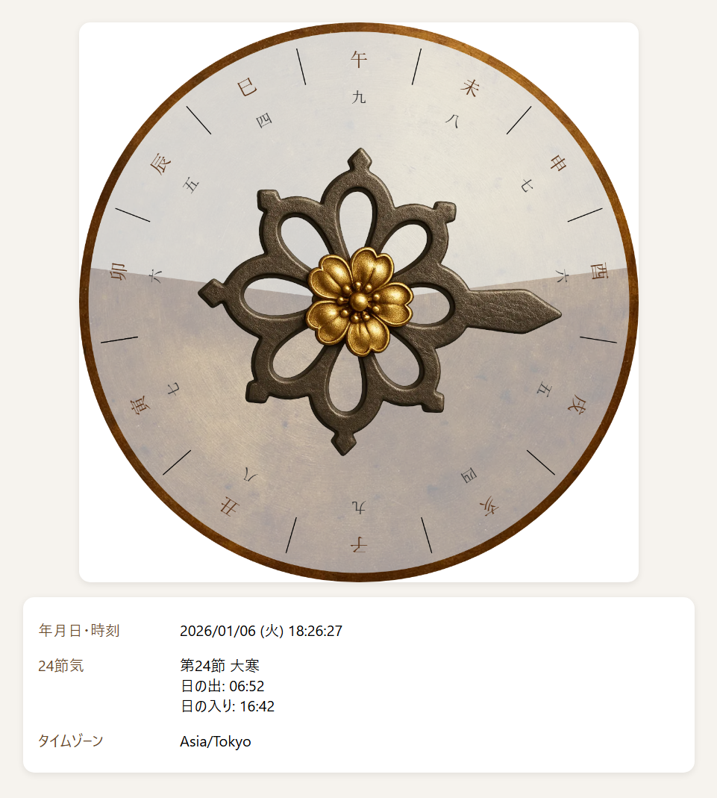

# Wadokei

[Japanese](./README.md)

[](https://tomneko.github.io/Wadokei/)

Wadokei is a web application that recreates the traditional **Edo-period Japanese temporal hour system** (unequal hours) in modern browsers.
It continuously displays time based on the current date/time, the 24 solar terms, sunrise, and sunset.



---

## 🌟 Features

- **Unequal-hour time system simulation**
  Daytime and nighttime hour lengths are calculated dynamically by season.

- **24 Solar Terms display**
  Shows the current solar term together with sunrise/sunset-related information.

- **Pure frontend implementation**
  Built with HTML / CSS / JavaScript only. No backend required.

### Twilight correction based on Kansei calendar interpretation

Historical Wadokei practice often treated day/night boundaries not as exact sunrise/sunset, but with twilight transitions around them.

Wadokei includes corrections inspired by historical Japanese calendar descriptions to better approximate traditional temporal-hour behavior.

---

## 🚀 Demo

GitHub Pages:
https://tomneko.github.io/Wadokei/

---

## 🛠 Tech Stack


- JavaScript (ES6)
- SunCalc 1.9.0
  - Used for sunrise/sunset and solar position calculations
- Custom astronomical correction logic
  - Date normalization (fixed to local 00:00)
  - Unequal-hour duration calculation
  - True solar noon derivation

---

## 📁 Directory Structure

```text
Wadokei/
  index.html
  docs/
    open-source-licenses.md
  core/
    wadokei.js
    config-loader.js
    consts-loader.js
  plugins/
    plugin.drawBackplane.js
    plugin.drawHand.js
    plugin.drawHand.yaesakura.js
  utils/
    datetime.js
    taiyou.js
  domain/
    24terms.js
  config/
    config.json
    consts.json
```

---

## 🔧 Local Usage

1. Clone this repository.
2. Open `index.html` in a browser.

---

## 📜 License


---

## 🙏 Acknowledgements


- [SunCalc](https://github.com/mourner/suncalc)
