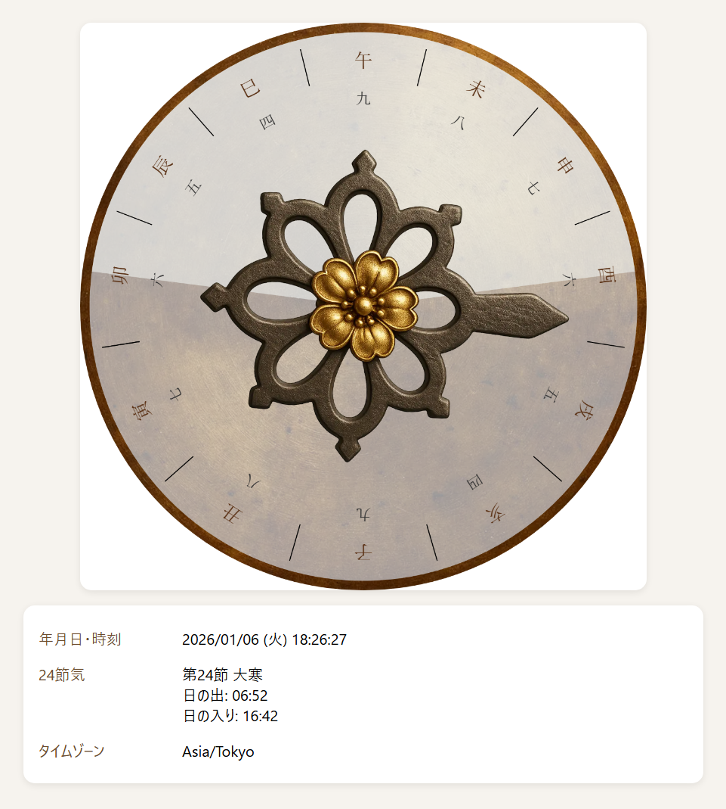

# 和時計（Wadokei）

江戸時代の不定時法を、現代のブラウザ上で再現する Web アプリケーションです。  
現在時刻・二十四節気・日の出/日の入りをもとに、  
伝統的な「和時計」の時刻をリアルタイムに表示します。

---

## 🌟 特徴

- **不定時法の再現**  
  季節によって長さが変わる「昼刻」「夜刻」を自動計算し、  
  現代の時刻を和時計の時刻に変換します。

- **二十四節気の表示**  
  現在の節気と、日の出・日の入り時刻を同時に表示。

- **純粋なフロントエンド実装**  
  HTML / CSS / JavaScript のみで動作し、  
  サーバー不要でどこでも動かせます。

### 寛政暦に基づく薄暮（薄明）補正

江戸時代の和時計では、昼と夜の境界を「日の出・日の入り」ではなく  
その前後に訪れる薄明・薄暮の時間帯を基準にしていました。

Wadokei では寛政暦の記述を参考にし、

- 日の出前の薄明（暁）
- 日の入り後の薄暮（黄昏）

を考慮した補正を行い、  
単純な太陽高度計算では得られない **和時計本来の刻の長さ** を再現しています。

---

## 🚀 デモ

GitHub Pages 版はこちら：
https://tomneko.github.io/Wadokei/

---

## 🛠 技術構成

- JavaScript（ES6）
- SunCalc 1.9.0  
  日の出・日の入り、太陽高度の計算に使用
- 独自の天文補正ロジック  
  - 日付の正規化（当日 0:00 固定）  
  - 不定時法の刻の長さ計算  
  - 真太陽時（true noon）の算出

---

## 📁 ディレクトリ構成

Wadokei/
  index.html
  core/
    wadokei.js
    config-loader.js
    consts-loader.js
  utils/
    datetime.js
    taiyou.js
  domain/
    24terms.js
  config/
    config.json
    consts.json

---

## 🔧 ローカルで動かす方法

1. リポジトリを clone  
2. `index.html` をブラウザで開くだけ  
   （サーバー不要）

---

## 📜 ライセンス

MIT License

---

## 🙏 謝辞

- [SunCalc](https://github.com/mourner/suncalc)  
  太陽位置計算ライブラリ
